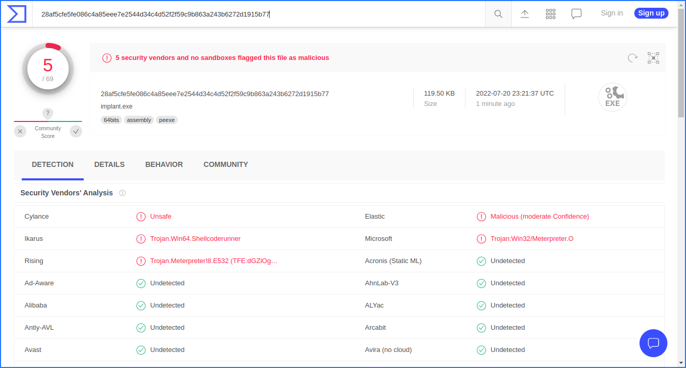

# Run That Shellcode!

This repository and all the code contained in it is part of my learning experience as I go through [RED TEAM Operator: Malware Development Essentials Course](https://institute.sektor7.net/view/courses/red-team-operator-malware-development-essentials/) try to obfuscate as much of the code as possible.

## Test 1 - The Raw Code

The executable was produced from direct code, i.e., no obfuscation methods were employed what so ever. The function calls and the payloads were kept intact without any funny business.

#### VirusTotal Score: **26/68**


## Test 2 - Funny Functions

This time, all the function calls were obfuscated and the `GetProcAddress` was used along with some XOR'd function names. However, the payload wasn't modified at all.

#### VirusTotal Score: **23/67**


## Test 3 - XOR it!

Now, its time to do some funny things with the payload. We begin with XOR'ing the payload with a string already available in the binary.

#### VirusTotal Score: **13/67**


## Test 4 - Encode The Encryption

Time to take it a bit further.  We Base64 encode the XOR'd payload and at runtime, we decode and decrypt the shell code. This drastically brings down the detection rate.

#### VirusTotal Score: **6/67**


## Test 5 - Write Some Custom Algorithms

At this point, we try to write our own little own algorithm. Why go through this trouble? Well, for one thing, it wouldn't be _that_ signatur'd. What I mean is that most AVs are familiar with signatures of XOR'd and Base64 Encoded Payload but wont't easily recognise a custom algorithm. 

Here, we have employed a simple algorithm:

```
arr[i] = arr[i]^arr[i+1] (where len(arr)-2> i >=0)
```

Or, it is better explained by this diagram:


Anyways, we encode our payload with this, decode it at runtime, pop that `calc.exe`. This, in turn, halves the detection rate.


